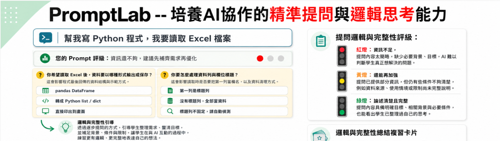

# Prompt Lab

Prompt Lab 是一套以「提問能力」為核心的 AI 素養學習工具，專為課堂教學與學生自主探究而設計。它不只是讓學生學會使用 AI，更希望引導學生理解：好的 AI 回答，往往來自清楚、有邏輯、有目的的提問。

在 Prompt Lab 中，學生會練習如何拆解問題、設定情境、補充條件、比較答案，並逐步修正自己的提示語。透過這樣的過程，學生能從「把問題丟給 AI」進一步學會「如何引導 AI 協助思考」，培養更成熟的資訊判讀能力與問題解決能力。

對教師而言，Prompt Lab 可作為 AI 素養課程、跨領域探究、寫作訓練、專題研究或邏輯思辨活動的輔助工具。它能幫助學生看見自己的思考歷程，也讓教師更容易引導學生討論：問題是否明確？條件是否足夠？AI 的回答是否合理？還可以如何追問？

Prompt Lab 的核心目標，是讓學生從「會用 AI」進階到「會駕馭 AI」。在與 AI 互動的過程中，學生不只是獲得答案，更是在練習提問、推理、判斷與反思，逐步建立面對未來學習與工作所需的 AI 素養。

推薦給初學 AI 協作的使用者。

[進入 Prompt Lab](https://air.cgu.edu.tw/workspace3/PromptLab/)

## 授權

本專案採用 MIT License 授權，詳見 [LICENSE](LICENSE)。
